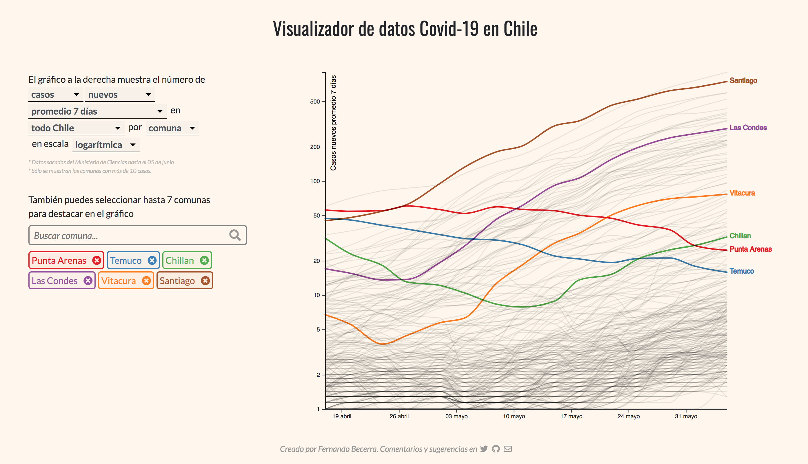

# Datos COVID-19 en Chile

## Visualizador

[Esta visualización interactiva](http://fernandobecerra.com/covid19chile) permite explorar los datos proporcionados por el [Ministerio de Ciencia](https://github.com/MinCiencia/Datos-COVID19). Los distintos menús dan la opción de elegir entre:

* casos y fallecidos confirmados,
* acumulados y nuevos,
* números totales, por cada 100.00 habitantes (tasa) y el promedio de 7 días
* nivel nacional, regional y comunal,
* escala lineal y logarítmica.

Además tiene la opción de destacar hasta 7 regiones o comunas ya sea buscándolas en la barra o haciendo click sobre el gráfico en una de las curvas.

De esta forma cada usuario puede explorar los datos por su cuenta y construir el gráfico de preferencia.

Si tienen cualquier duda, consulta, sugerencia o comentario, me puede contactar en mi [cuenta de Twitter](https://twitter.com/fdo_becerra).

## Análisis

En [esta carpeta](analisis/) he puesto algunas de las rutinas en jupyter notebooks que he usado para graficar otros datos. Hasta el momento puedes ver:

* la [correlación](analisis/Pobreza%20y%20decesos.ipynb) entre número de muertes e índice de pobreza en las comunas de la Región Metropolitana, y
*  el [número de decesos totales](analisis/Decesos%20historicos%20en%20Chile.ipynb) informado por el DEIS desde el año 2000.
